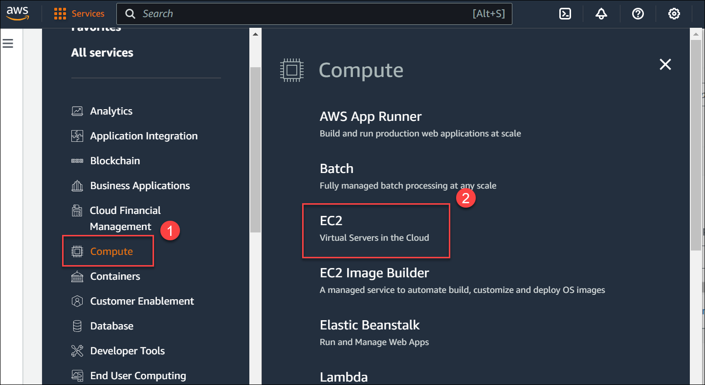
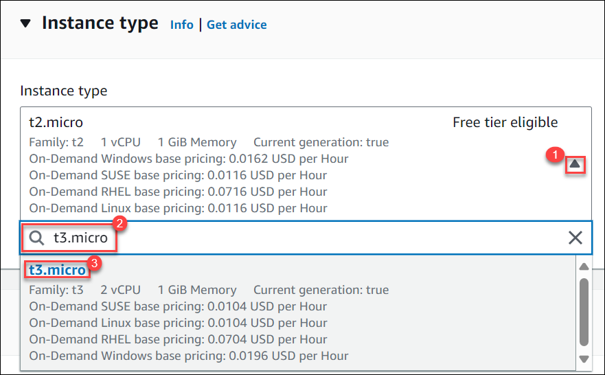
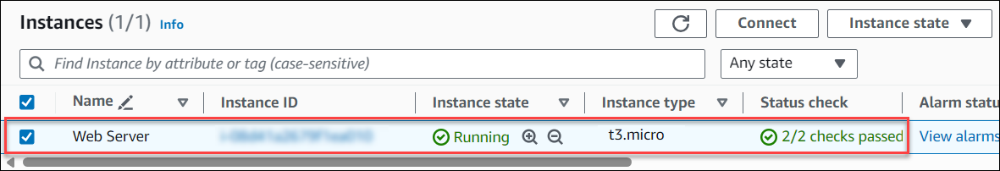

# Amazon EC2 Instance

## Task 1: Create the Amazon EC2 Instance

1. In the AWS Console, click on **Services**.

2. From the left side menu, select **Compute (1)** and click on **EC2 (2)**.
 
   

3.  From the **EC2 dashboard (1)**, select **Launch instance (2)**.

4.  On the **Launch an Instance** page, beginning with the **"Name and Tags** section,

-  Provide the **Name** of the instance as **Web Server**.

-  Choose the **Amazon Linux 2023** as the  **Amazon Machine Image (AMI)** from **Quick Start**.

-  In the **Instance type** section, click on drop-down menu **(1)** and search **(2)** and select **t3.micro (3)** from the drop-down menu.

   

5. In the **key pair (login)** section click on the **Create a new key pair**.
   
6. On the **Create key pair** fly-out page, provide:
   * **Key pair name : EC2KeyPair (1)**
   * **Key pair type : RSA (2)**
   * **Private key file format : .pem (3)**
7. Then click on the **Create key pair (4)**.

8. Your key pair will be created and the console will automatically download the **private key file (.pem)** in your local system.

## Task 2: Configure the Instance Settings

1. In the **Network Settings** section, click on the **Edit**. 

   * For the **VPC**, Choose **Lab-vpc** which we created during exercise 1 and under subnets select **Public-subnet**

   * For the **Auto-assign public ip**, choose the option **Enable** from drop down.

   * In the **Firewall (security groups)** section, select the **Create a security group (1)** option.
   
   * For the **Security group name**, enter **Web Server security group (2)**. 
   
   * For the **Description**, enter **Security group for my web server (3)**. and click on **Remove (4)** to remove the existing Inbound security group rules.

2. Keep **Storage Configuration** set to default and leave all other settings to default.

3. After configuring the instance settings, click on the **Launch instance** on the bottom-right.

4. Now, on the **Instances** page select the instance that you created in the last step.

5. Verify the instance status, it should be in  **Running** state, and **Status check** should display **2/2 checks passed**.

      

**You have successfully launched an Amazon EC2 instance with termination protection enabled.**
