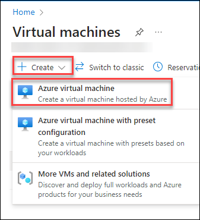

# Create a Virtual Machine

## 1. Sign in to the Azure Portal and Navigate to Virtual Machines:

   1. Go to the Azure Portal.

   2. Sign in with your Azure account credentials.

   3. Search and Click on **Virtual machines.**

   4. Click the **+ Create** button, then select **Azure Virtual machine**.

      

## 2. Configure Basic Settings:

   1. Subscription: Select your Azure subscription.

   2. Resource group: Either select an existing resource group or create a new one.

   3. Virtual machine name: 

   ```  
   <inject key="odluser" value="-vm" />
   ``` 


   4. Region: Choose the Azure region where you want to deploy your VM.

   5. Image: Select the operating system image you want (e.g., Windows Server 2019).

   6. Size: Choose a VM size.

   5. Authentication type: Choose "Password".

   6. Username: Enter a username for the VM.

   7. Password: Enter and confirm a strong password (if you chose password authentication).

   8. Public inbound ports: Choose the ports you want to open (e.g., "Allow selected ports").

   9. Select inbound ports: Typically, you might select ports like SSH (22) for Linux or RDP (3389) for Windows.

## 3. Review and Create:

   1. Click the "Review + create" button.

   2. Validate the configurations and then click "Create".

   3. Wait for the deployment to complete.

>**Congratulations** on completing the Task! Now, it's time to validate it. Here are the steps:

> - Hit the Validate button for the corresponding task. If you receive a success message, you have successfully validated the lab. 

> - If not, carefully read the error message and retry the step, following the instructions in the lab guide.

> - If you need any assistance, please contact us at labs-support@spektrasystems.com.

<validation step="751940ef-53b7-454d-a19a-c3546d06ca38" />
