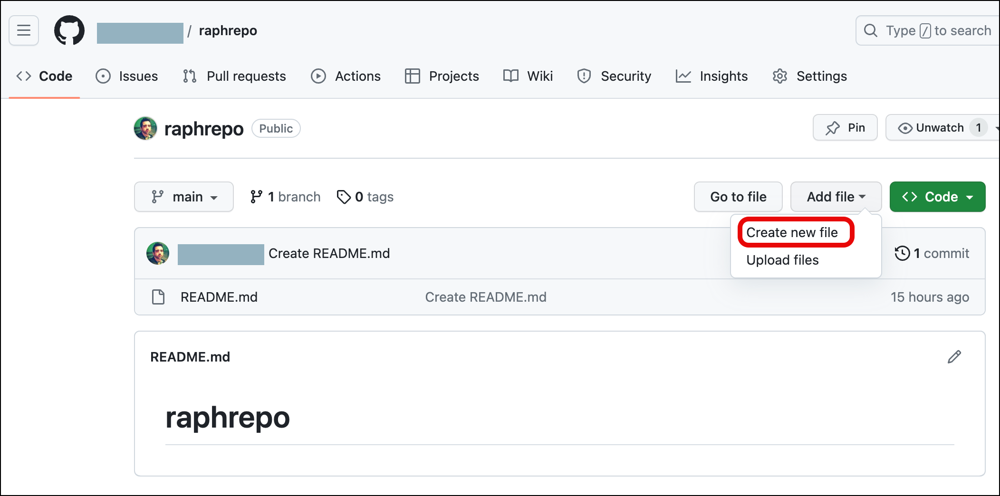
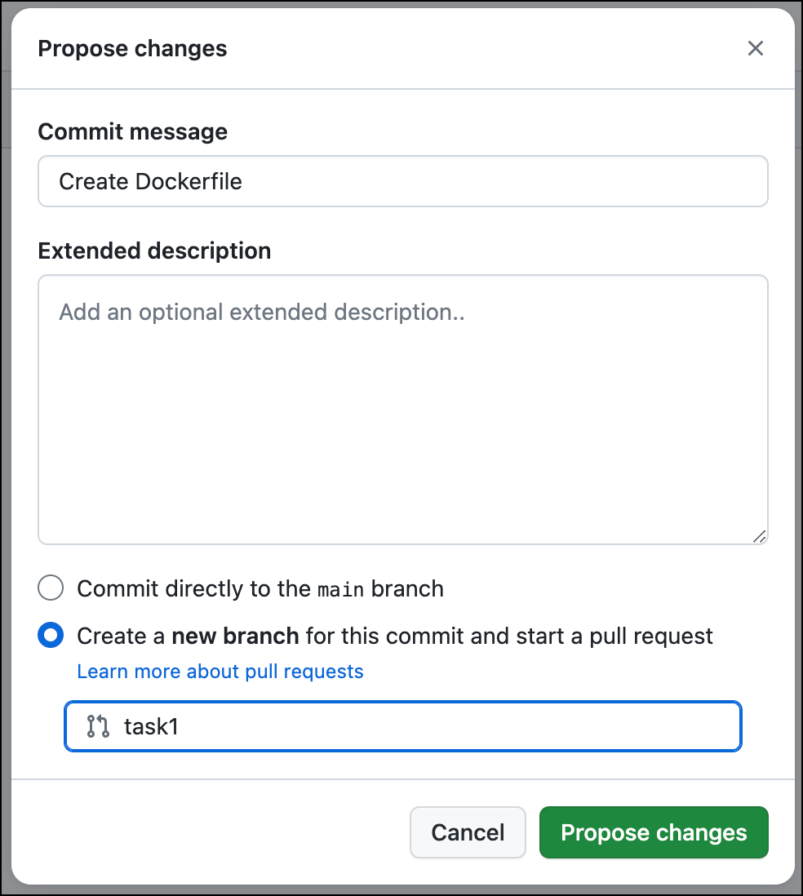
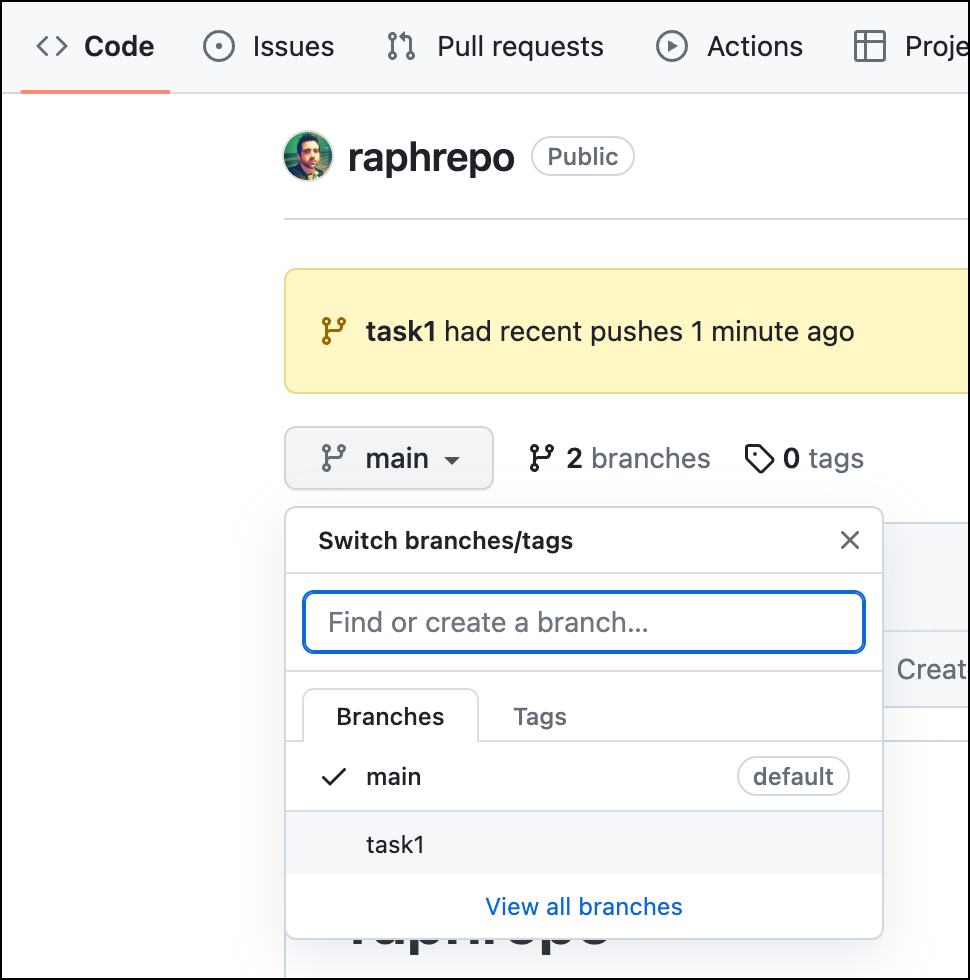
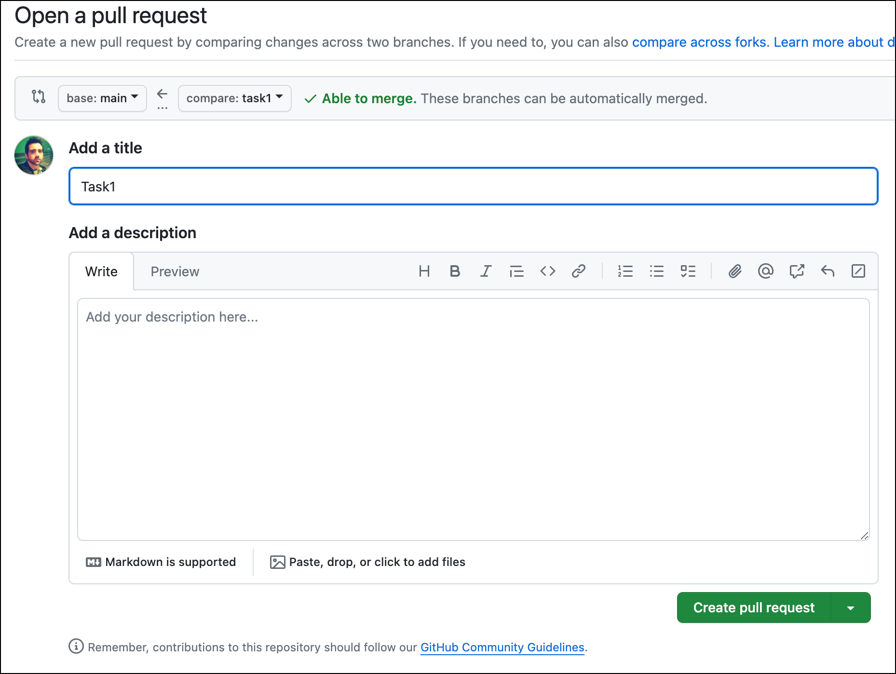
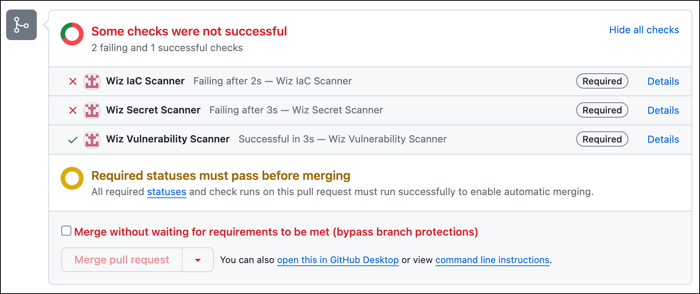

<div style="margin-right: 50px; margin-left: 30px;">

# Task: CI/CD Code Scanning
---

In this task, we will simulate part of a CI/CD pipeline where developers commit code to a GitHub repository. The Wiz GitHub Connector is able to scan for IaC misconfigurations, Vulnerabilities, and Secrets in committed codes.

## Commit misconfigured code and secret to repository

1. In your newly create GitHub repository, click on **Add file > Create new file**

   <p align="left">
      
      </p> 

1. Copy the contents from the block below and paste in the new file. Name it `Dockerfile`

    <div style="margin-right: 150px;">

    ```
    FROM ubuntu:16.04
    RUN mkdir -p /home/lab/.aws/
    COPY awssecret.json /home/lab/.aws/credentials
    RUN apt-get update && \
        apt-get install -y apache2=2.4.18-2ubuntu3.17
    EXPOSE 80
    CMD ["apache2ctl", "-D", "FOREGROUND"]
    ``` 

    </div>

1. Click on **Commit changes...**

1. In the *Proposed changes* pop-up select **Create a new branch..** and give it the name `task1`. 

   <p align="left">
      
      </p> 

1. Click on **Propose changes**

1. Add a new file to the same branch by selecting **< > Code**, then changing the branch to `task1`.

   <p align="left">
      
      </p> 

1. Once in the `task1` branch, click on **Add file > Create new file**.

1. Click on **Commit changes...**.

1. In the *Proposed changes* pop-up select **Commit directly to the *task1* branch**. Click on **Commit changes**.

1. Now lets create a Pull Request (PR), to move our new files into the `main` branch, which is in our case the production branch. You can click on the **Compare & pull request** button or go to the **Pull requests** menu and create a new PR, both will lead to the same *Open a pull request* workflow.

1. On the *Open a pull request* page, click on **Create pull request**.

   <p align="left">
      
      </p> 

1. In the Pull request commit conversation page, you will see the Wiz checks in action, and as result you should see the `Wiz IaC Scanner` and `Wiz Secret Scanner` failed.

   <p align="left">
      
      </p> 

Before addressing the issues found by the scans, lets look into what Wiz collects and shows in the portal.

Please provide feedback about the lab guide
<grouped-questions source="https://raw.githubusercontent.com/dhananjaygr/InlineQuestions/main/100-Foundation/questions/Page6/page6-metadata.md" />
